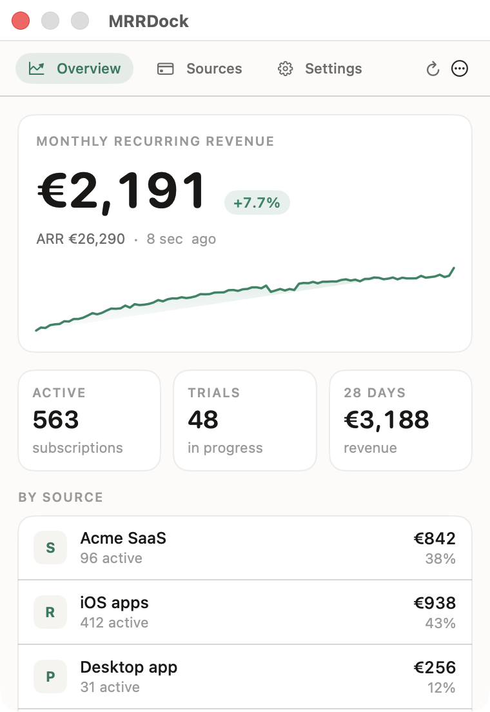
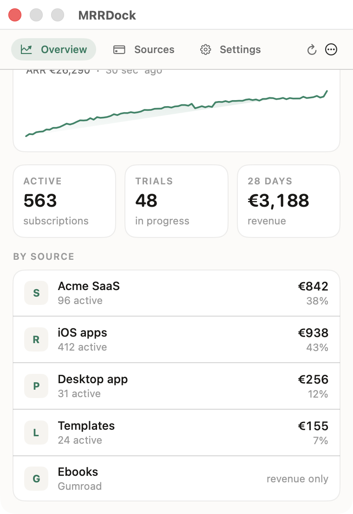
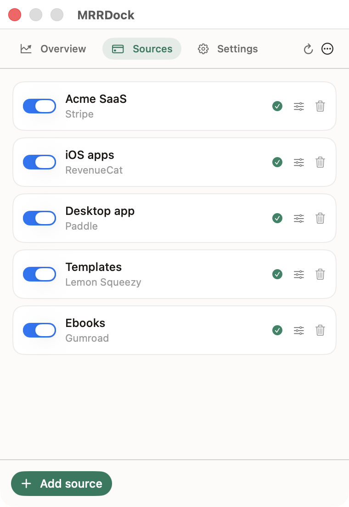
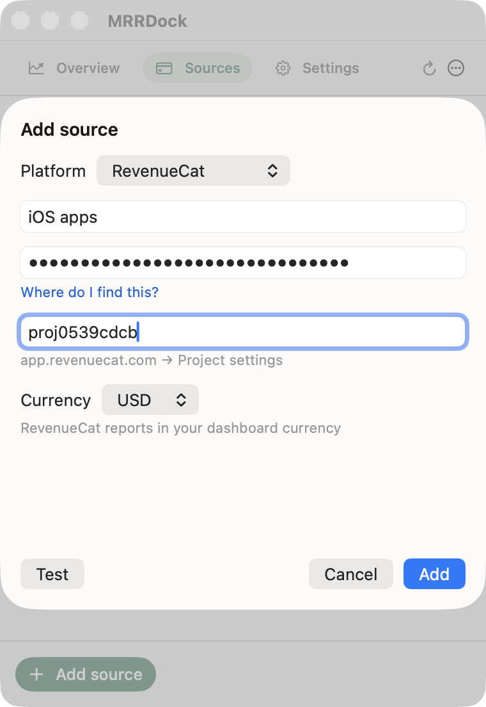
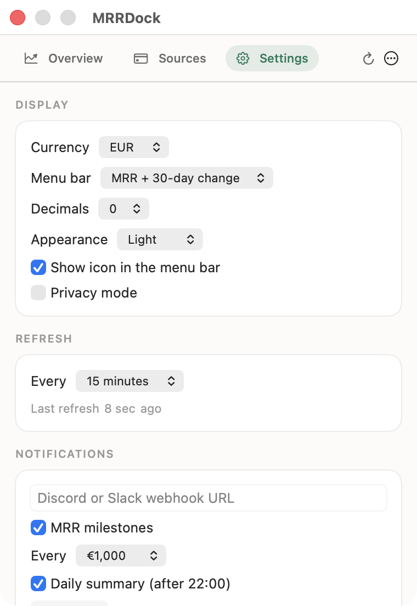
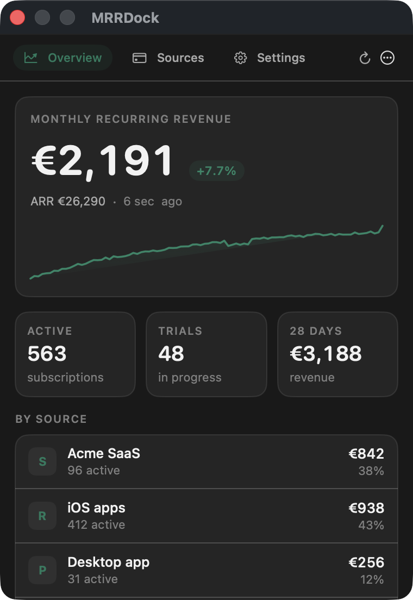

<div align="center">

# MRRDock — MRR tracker for the macOS menu bar

**A free, open-source MRR tracker for Mac. It reads Stripe, RevenueCat, Paddle, Lemon Squeezy, Polar, Dodo Payments and Gumroad, adds them up, and keeps the total one glance away in your menu bar.**

No account, no server, no subscription. Your API keys stay in your macOS Keychain and the numbers never leave your Mac.

[](https://github.com/simonsruggi/MRRDock/releases/latest)
[](https://github.com/simonsruggi/MRRDock/releases)
[](https://github.com/simonsruggi/MRRDock/releases/latest)
[](https://swift.org)
[](LICENSE)
[](https://github.com/simonsruggi/MRRDock/actions/workflows/ci.yml)
[](https://github.com/simonsruggi/MRRDock)
[](https://github.com/sponsors/simonsruggi)

```bash
brew install --cask simonsruggi/tap/mrrdock
```



</div>

---

## Contents

- [Why MRRDock](#why-mrrdock)
- [Features](#features)
- [Screenshots](#screenshots)
- [Supported platforms](#supported-platforms)
- [Install](#install)
- [Connect each platform](#connect-each-platform) — [Stripe](#stripe) · [RevenueCat](#revenuecat) · [Paddle](#paddle) · [Lemon Squeezy](#lemon-squeezy) · [Polar](#polar) · [Dodo Payments](#dodo-payments) · [Gumroad](#gumroad) · [Custom endpoint](#custom-endpoint-superwall-app-store-connect-anything-else)
- [How MRR is calculated](#how-mrr-is-calculated)
- [MRRDock vs the alternatives](#mrrdock-vs-the-alternatives)
- [Menu bar modes](#menu-bar-modes)
- [Notifications](#notifications)
- [Privacy and security](#privacy-and-security)
- [Build from source](#build-from-source)
- [FAQ](#faq)
- [Troubleshooting](#troubleshooting)
- [Roadmap](#roadmap)
- [Contributing](#contributing)

## Why MRRDock

If you sell software, your revenue is scattered. The SaaS is on Stripe, the iOS apps report through RevenueCat, the desktop app went through Paddle because of VAT, the templates sit on Lemon Squeezy. Answering "how am I doing this month?" means four dashboards, four logins, and a mental sum that ignores the fact that three of them bill in dollars.

MRRDock does that sum for you, once every fifteen minutes, and leaves the answer in the menu bar:

- **One number, all platforms.** Not four tabs — one total, in your currency.
- **Local and private.** No account to create, no data uploaded, no analytics. The app talks to your payment platforms directly, from your Mac.
- **Free forever, MIT licensed.** No paid tier, no seat limit, no "upgrade to see more than one source".
- **Honest arithmetic.** Yearly plans divided by twelve, trials counted but not billed, unpriceable usage-based plans flagged rather than guessed.

It's a companion to the analytics products, not a replacement: ChartMogul, Baremetrics or the RevenueCat dashboard will do cohorts, LTV and churn analysis that a menu-bar popover shouldn't. MRRDock answers the one question you ask twenty times a day, without opening a browser.

## Features

- **Multi-platform aggregation** — Stripe, RevenueCat, Paddle, Lemon Squeezy, Polar, Dodo Payments, Gumroad and any HTTPS endpoint of your own, in any combination. Several accounts of the same platform are fine: two Stripe accounts and three RevenueCat projects add up like anything else.
- **Multi-currency** — every source is converted into your display currency (EUR, USD, GBP, CHF, JPY, CAD, AUD, SEK, NOK, DKK, PLN, BRL, INR) with live exchange rates, cached for 12 hours. Amounts that can't be converted are shown separately, never silently dropped.
- **MRR trend** — 24H, 7D, 1Y or a custom range, with the "vs 30 days ago" delta. The history is pulled from your provider's own MRR series, so the chart shows the business, not the day you installed MRRDock. No server, no account: it's a JSON file on your Mac.
- **Seven menu bar modes** — MRR · MRR + 30-day change · ARR · revenue over 28 days · active subscriptions · one source at a time (cycling every 4 seconds) · icon only.
- **Per-source breakdown** — what each platform contributes, in currency and as a share of the total, with its active subscription count.
- **Privacy mode** — replaces every figure with `•••` for screen sharing or a café, revealed with one click.
- **Discord and Slack notifications** — MRR milestones ("just crossed €5,000") and an optional daily summary at 22:00.
- **Credential test before saving** — the Add source sheet has a Test button that calls the API and reports the real MRR, or the platform's own error message, before anything is stored.
- **Failure-tolerant** — a source that errors keeps its last known figure with an error badge instead of dropping the total to zero, and the popover says how many sources are stale.
- **Light, dark and system appearance**, native SwiftUI, universal binary (Apple Silicon and Intel), signed and notarized, with **built-in auto-updates**.

## Screenshots

<div align="center">










<sub>Figures in the screenshots are demo data.</sub>

</div>

## Supported platforms

| Platform | MRR | Active subs | Trials | 28-day revenue | Endpoint used |
| --- | :---: | :---: | :---: | :---: | --- |
| **Stripe** | ✅ | ✅ | ✅ | optional | `/v1/subscriptions`, priced item by item |
| **RevenueCat** | ✅ | ✅ | ✅ | ✅ | `/v2/projects/{id}/metrics/overview` |
| **Paddle** (Billing) | ✅ | ✅ | ✅ | — | `/subscriptions`, priced per item |
| **Lemon Squeezy** | ✅ | ✅ | ✅ | — | `/v1/subscriptions` + each plan's price |
| **Polar** | ✅ | ✅ | — | ✅ | `/v1/metrics` |
| **Dodo Payments** | ✅ | ✅ | — | — | `/subscriptions`, priced per subscription |
| **Gumroad** | — | — | — | ✅ | `/v2/sales` |
| **Custom endpoint** | ✅ | ✅ | ✅ | ✅ | your own HTTPS URL |

Every key is used read-only: MRRDock issues `GET` requests and nothing else.

**Why Gumroad has no MRR:** Gumroad's API exposes sales, not a subscription ledger you can price. Deriving an MRR from one-off sales would be a guess, so the source contributes revenue only — and says so in the UI.

## Install

```bash
brew install --cask simonsruggi/tap/mrrdock
```

Or [**download MRRDock.zip**](https://github.com/simonsruggi/MRRDock/releases/latest), unzip it and drag the app to `/Applications`. It's signed with a Developer ID and notarized by Apple, so it opens with a double-click — no right-click dance, no "unidentified developer".

**Auto-updates** are built in (Sparkle): MRRDock checks a signed update feed every 6 hours and offers new versions in place. Settings → *Check for updates* forces a check, and the Homebrew cask is marked `auto_updates true` so brew leaves it alone.

Prefer to build it yourself? See [Build from source](#build-from-source) — it takes one command.

MRRDock lives in the menu bar: there's no Dock icon and no window. Click the figure to open the popover.

## Connect each platform

Open the popover → **Sources** → **Add source**, pick the platform, paste the key, hit **Test**, then **Add**. Below is where each key comes from and which permissions it needs.

### Stripe

1. Stripe Dashboard → **Developers → API keys → Create restricted key**.
2. Give it **read** access to **Subscriptions** (and to **Charges** if you want the 28-day revenue figure). Leave everything else at "None".
3. Paste the `rk_live_…` key into MRRDock.

Options: **Connected account ID** (`acct_…`) reads a connected account instead of the platform's own subscriptions; **Include revenue over the last 28 days** enables the extra Charges call.

A restricted key is worth the extra minute: even if your Mac were compromised, that key can only list subscriptions.

### RevenueCat

1. RevenueCat → **Project settings → API keys → New API key** (a **v2 secret key**), with read access to the project's overview metrics.
2. Copy the **Project ID** from the same settings page (`proj…`).
3. Paste both into MRRDock.

MRRDock reads RevenueCat's own MRR rather than recomputing one from the subscriber list, so the number matches the RevenueCat dashboard exactly — including its currency, which the app picks up automatically.

Add one source per project: the totals then include every app you ship.

### Paddle

1. Paddle → **Developer tools → Authentication → New API key**, read access to subscriptions.
2. Paste the `pdl_live_apikey_…` key. Tick **Sandbox** to point the source at `sandbox-api.paddle.com`.

Paddle **Billing** only (the v2 API). Paddle Classic is not supported.

### Lemon Squeezy

1. Lemon Squeezy → **Settings → API → Create API key**.
2. Paste it. **Store ID** is optional and only needed if your account has several stores and you want one source per store.

Trials (`on_trial`) are counted separately and contribute no MRR.

### Polar

1. Polar → **Settings → Developers → New token** (an organization access token, `polar_oat_…`), with read access to metrics.
2. Paste it. **Organization ID** is optional; **Sandbox** switches to `sandbox-api.polar.sh`.

### Dodo Payments

1. Dodo dashboard → **Developer → API keys**.
2. Paste the key and tick **Test mode** if it's a test key (the app then calls `test.dodopayments.com` instead of `live.`).

MRR uses `recurring_pre_tax_amount`, so a merchant-of-record VAT charge doesn't inflate your figures.

### Gumroad

1. Gumroad → **Settings → Advanced → Applications → Generate access token**.
2. Paste it. This source reports **28-day revenue** only, no MRR.

### Custom endpoint (Superwall, App Store Connect, anything else)

Some platforms have no public revenue API — Superwall today, for instance — and some keys you'd rather not keep on a laptop at all. Both cases are covered by the custom source: point MRRDock at an HTTPS URL of yours (a Cloudflare Worker, a Lambda, a static file your backend regenerates) that returns:

```json
{
  "mrr": 4820.50,
  "currency": "EUR",
  "active_subscriptions": 312,
  "trials": 24,
  "revenue_28d": 6100
}
```

Only `mrr` is required (`monthly_recurring_revenue`, `monthlyRecurringRevenue` and `value` are accepted too). The response may be wrapped in `data` or `result`, the field holding the MRR can be named in the source options, and an optional bearer token is sent with the request. Everything else is optional and simply won't be shown.

This is the recommended setup for App Store Connect and Google Play sales reports, for an internal billing table, and for keeping a live Stripe key on a server you control instead of on your desktop.

## How MRR is calculated

For every recurring line item MRRDock knows the price, the interval, the quantity and any percentage discount:

```
monthly = unit_price × quantity × (intervals_per_month ÷ interval_count) × (1 − discount)
```

where `intervals_per_month` is **30.4375** for daily, **4.348** for weekly, **1** for monthly and **1/12** for yearly — the average Gregorian month (365.25 ÷ 12), so twelve monthly plans and one yearly plan reconcile to the cent instead of drifting apart.

Decisions worth knowing about, because they're the ones that make dashboards disagree:

| Case | What MRRDock does |
| --- | --- |
| Free trial | Counted in **Trials**, contributes **€0** to MRR |
| Yearly plan | Divided by 12 |
| Every-3-months plan | Divided by 3 |
| Seats / quantity | Multiplied |
| Percentage coupon (−20%) | Applied |
| Fixed-amount coupon (−€5) | **Not** applied — prorating it across a multi-item subscription needs data these APIs don't return |
| Usage-based / tiered / metered price | **Not guessed.** Counted as "could not be priced" and shown as a warning, so an understated total is visible |
| Taxes | Excluded where the provider separates them (Dodo's pre-tax amount, Paddle's unit price) |
| Past due / grace period | Follows the provider's own status: still active until the provider says otherwise |
| Mixed currencies | Kept separate until an exchange rate exists, then converted; anything unconvertible is reported, not dropped |
| ARR | Exactly MRR × 12, nothing smoothed or annualised behind your back |

Exchange rates come from Yahoo Finance's public quote endpoint (no key, no identifying data) and are cached for 12 hours.

## MRRDock vs the alternatives

Every MRR tracker for the Mac menu bar makes a different trade. Here is where MRRDock sits, so you can pick the right one rather than the first one.

| | MRRDock | CatBar | IndieBar | Baremetrics / ChartMogul / ProfitWell |
| --- | --- | --- | --- | --- |
| Price | Free, MIT | Freemium, Pro subscription | Paid, one-time | Paid monthly, per MRR tier |
| Source code | Open | Closed | Closed | Closed |
| Platforms read | Stripe, RevenueCat, Paddle, Lemon Squeezy, Polar, Dodo, Gumroad, custom HTTPS | RevenueCat | Stripe, RevenueCat, GA4 | Stripe, and whatever the plan includes |
| Several accounts per platform | Yes | — | — | Depends on plan |
| Where the data goes | Nowhere: Mac → platform API | Mac → RevenueCat API | Mac → platform APIs | Your billing data on their servers |
| Cohorts, LTV, churn analysis | — | — | — | Yes, that's the point |
| Menu bar | Yes | Yes | Yes | Browser |

Read it this way:

- **You ship on more than one platform and want one number.** That is what MRRDock was built for, and the reason it prices subscriptions item by item instead of trusting a single provider's summary.
- **You only use RevenueCat and want notifications, sounds and transaction history.** CatBar is the more polished single-platform app.
- **You want cohorts, LTV, churn and forecasting.** Use Baremetrics or ChartMogul. MRRDock answers one question — "what is my MRR right now?" — and deliberately stops there.
- **You want a free and open-source MRR tracker whose API keys never leave your Keychain.** MRRDock is the only one of the four with a source tree you can read before you paste a Stripe key into it.

## Menu bar modes

| Mode | Example |
| --- | --- |
| MRR | `€2,191` |
| MRR + 30-day change | `€2,191 +8%` |
| ARR | `€26,290 ARR` |
| Revenue (28 days) | `€3,188` |
| Active subscriptions | `563 subs` |
| Cycle through sources | `Acme SaaS €842` → `iOS apps €938` → … |
| Icon only | 📈 |

Figures above €10,000 are abbreviated (`€26.3k`) so the menu bar stays narrow. Privacy mode replaces the lot with `•••`.

## Notifications

Paste a **Discord** or **Slack** incoming webhook in Settings and pick what should reach it:

- **MRR milestones** — fires once when MRR first crosses a step you choose (every €100, €500, €1,000, €5,000 or €10,000). Only upward crossings fire, and each milestone fires once.
- **Daily summary** — after 22:00, one message with MRR, ARR, the 30-day change, active subscriptions and trials.

The payload shape follows the host automatically: a coloured embed for Discord, plain text for Slack. Only those two hosts are accepted — your revenue figures shouldn't be one typo away from an arbitrary server.

## Privacy and security

- **API keys are stored in the macOS Keychain** (service `com.simone.mrrdock`), never in the app's JSON file, never in logs, never in a backup you might paste in an issue.
- **Requests go only to the platforms you configure**, plus Yahoo Finance for exchange rates (a currency pair, nothing about you).
- **No account, no login, no analytics, no telemetry, no crash reporting.** Nobody, including the author, can see your revenue.
- **HTTPS only.** A custom endpoint on `http://` is refused rather than sent your token in clear.
- Settings, sources and MRR history live in `~/Library/Application Support/MRRDock/`; deleting that folder resets the app, and removing a source deletes its key from the Keychain.
- Read-only by construction: the app only issues `GET` requests, so a key with write access still can't be used to change anything through MRRDock.

## Build from source

```bash
git clone https://github.com/simonsruggi/MRRDock.git
cd MRRDock
./build-app.sh          # universal MRRDock.app in ./build
open build/MRRDock.app
```

Or straight from SwiftPM:

```bash
swift run MRRDock       # runs the menu bar app
swift test              # 37 tests over the pure logic
```

Requirements: macOS 14+, Swift 5.9 (Xcode 15). No package dependencies — nothing to vendor, nothing to audit but the app itself. See [PROJECT.md](PROJECT.md) for the architecture.

## FAQ

**Is it really free?**
Yes. MIT licensed, no paid tier, no limits on sources. If it saves you a browser tab a day, [sponsoring](https://github.com/sponsors/simonsruggi) keeps it going.

**Does my revenue data leave my Mac?**
No. There's no MRRDock server. The app calls your payment platforms directly and stores everything locally.

**Is giving a desktop app my Stripe key safe?**
It's stored in the Keychain and only sent to Stripe over HTTPS — but you don't have to: create a **restricted key** limited to reading subscriptions, or use the [custom endpoint](#custom-endpoint-superwall-app-store-connect-anything-else) and keep the real key on your own server.

**Why doesn't the total match my Stripe dashboard exactly?**
Stripe's dashboard MRR (Sigma / Revenue Recognition) applies its own rules to proration, taxes and fixed-amount coupons. MRRDock states its rules in [How MRR is calculated](#how-mrr-is-calculated), so any difference is explainable rather than mysterious. If your account has usage-based prices, check the "could not be priced" warning under the totals.

**Can I add several accounts of the same platform?**
Yes — as many as you like. Each is a separate source with its own name, key and toggle.

**Does it support Superwall?**
Not directly: Superwall has no public revenue API. Route it through the [custom endpoint](#custom-endpoint-superwall-app-store-connect-anything-else), or read the same subscriptions through RevenueCat if you use both.

**What about App Store Connect and Google Play?**
Not yet as first-class sources (they need report downloads rather than a metrics API). Today: RevenueCat if you use it, or the custom endpoint. Native support is on the [roadmap](#roadmap).

**Does it drain the battery?**
It sleeps between refreshes — every 15 minutes by default, configurable from 5 minutes to 6 hours — and does nothing else while idle.

**Where's the 30-day change on day one?**
It appears once there's history to compare against. MRRDock refuses to compute growth against a baseline that isn't 30 days old, because "+400% since Tuesday" is not information. Providers that expose their own MRR series (RevenueCat) are backfilled once a day, so the baseline is usually there from the first launch.

**Which macOS versions?**
macOS 14 Sonoma and later, Apple Silicon and Intel.

**Is there a free alternative to Baremetrics or ChartMogul?**
For the MRR figure itself, yes: MRRDock reads the same subscriptions from the same platforms and costs nothing. For cohort analysis, LTV and churn forecasting, no — see [MRRDock vs the alternatives](#mrrdock-vs-the-alternatives).

**Can it show MRR from several Stripe accounts and RevenueCat projects at once?**
Yes, that's the main reason it exists. Add one source per account or project, in any mix, and the menu bar shows the converted total.

**Is there a Windows or Linux version?**
No. MRRDock is a native macOS menu bar app (SwiftUI, no dependencies). The provider code is plain Swift and reusable, but there's no cross-platform build.

## Troubleshooting

| Symptom | Fix |
| --- | --- |
| `HTTP 401: Invalid API key` | Wrong key, or a test key on a live source (and vice versa). The error shown is the platform's own message. |
| `Missing Project ID` (RevenueCat) | The `proj…` id from Project settings goes in its own field, not in the key field. |
| MRR lower than expected | Check the warnings under the totals: unpriced usage-based subscriptions, or a currency with no exchange rate. |
| A source shows a warning triangle | It failed its last refresh and is showing its previous figure. Hover the triangle for the reason. |
| Nothing in the menu bar | With many menu bar items macOS hides the newest ones. Free a slot, or use a menu bar manager. |
| "MRRDock is damaged / unidentified developer" | Shouldn't happen — the app is notarized. If it does, the download was corrupted: delete it and grab the zip again from Releases. |
| macOS asks for your Keychain password | Click **Always Allow**. The Keychain ties a saved key to the signature of the app that stored it, so a copy signed differently (a local ad-hoc build next to the released app) is treated as a different app. If the prompt keeps coming back, delete the source and add it again from the copy you actually use. |

## Roadmap

- App Store Connect and Google Play as first-class sources
- Per-source history and charts, not just the total
- Localisation (the app ships English only today)
- Churn and net-new MRR, where providers expose them

## Contributing

New providers are welcome and small — a case in `ProviderKind`, an implementation of `RevenueProvider`, a parsing test with a real response body. [PROJECT.md](PROJECT.md) walks through the architecture and the five steps.

Bug reports and feature requests: [open an issue](https://github.com/simonsruggi/MRRDock/issues). If MRRDock's number disagrees with your dashboard's, that's the most useful issue you can file — bring the two figures and the platform.

## License

MIT — see [LICENSE](LICENSE).

---

<div align="center">

Made with ❤️ by [Simone Ruggiero](https://simoneruggiero.com?utm_source=MRRDock&utm_medium=readme)

</div>
